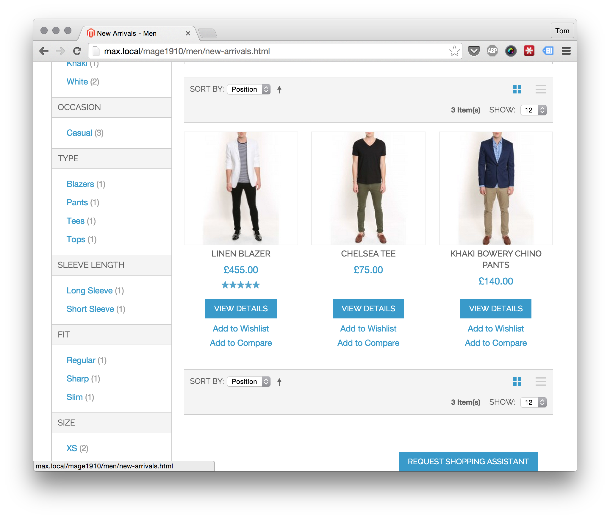
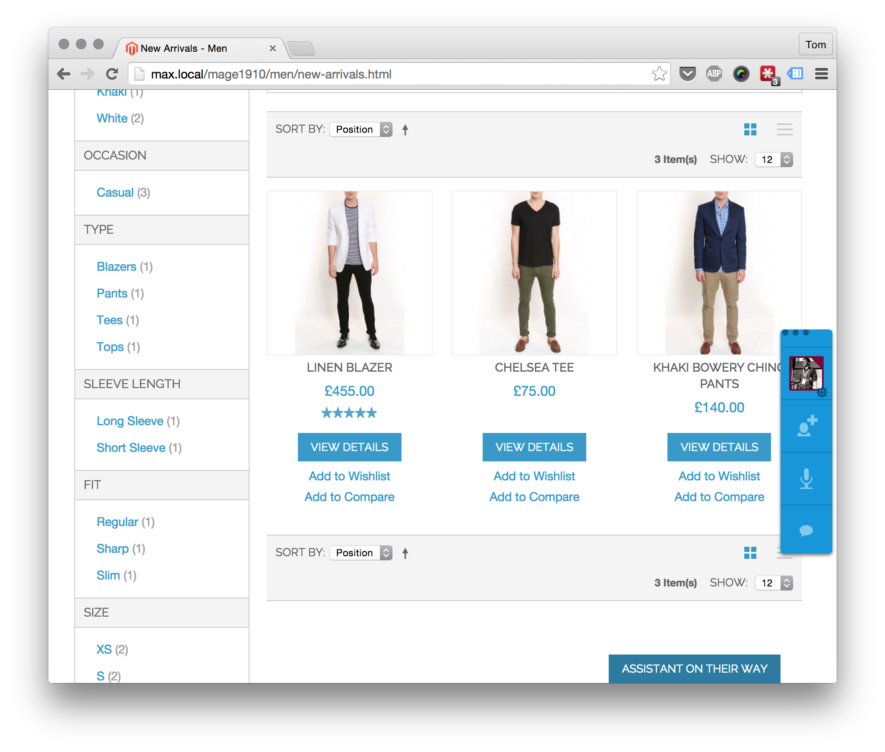
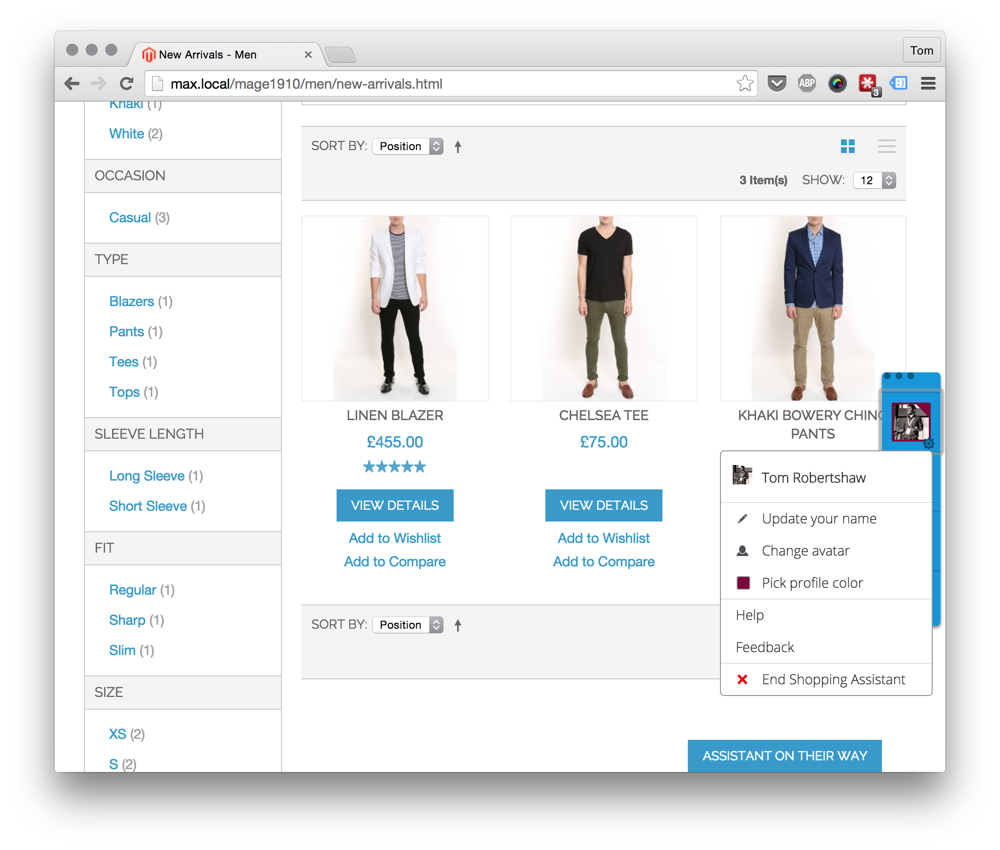
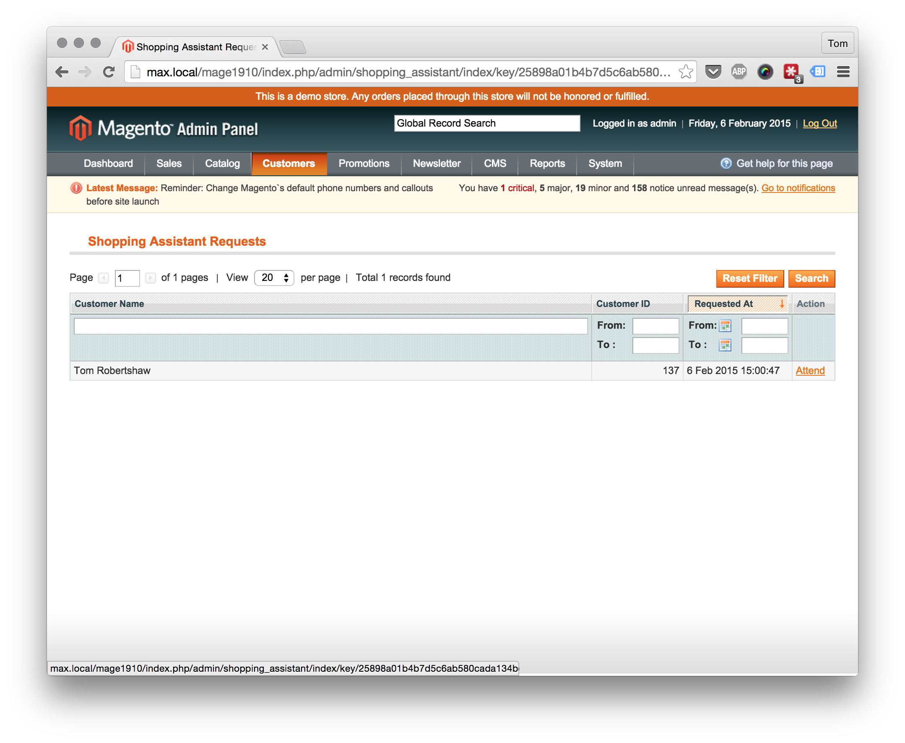
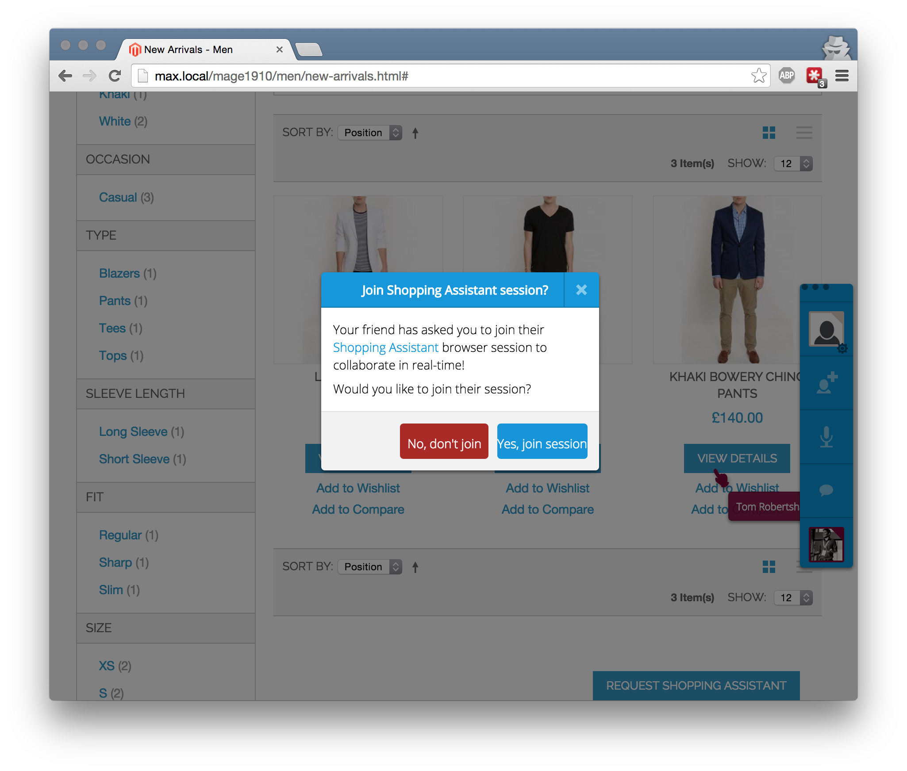
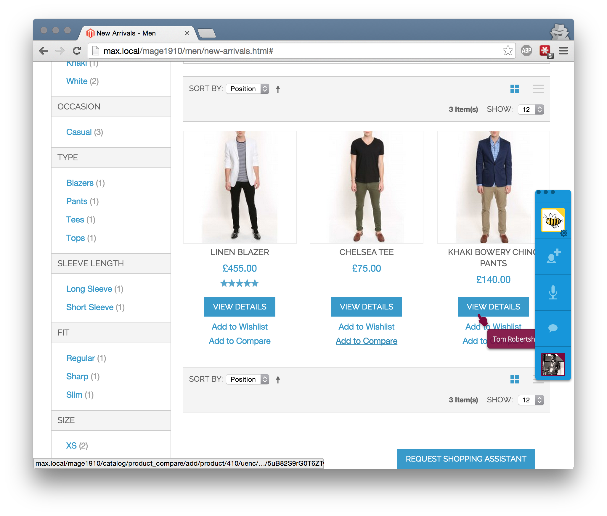
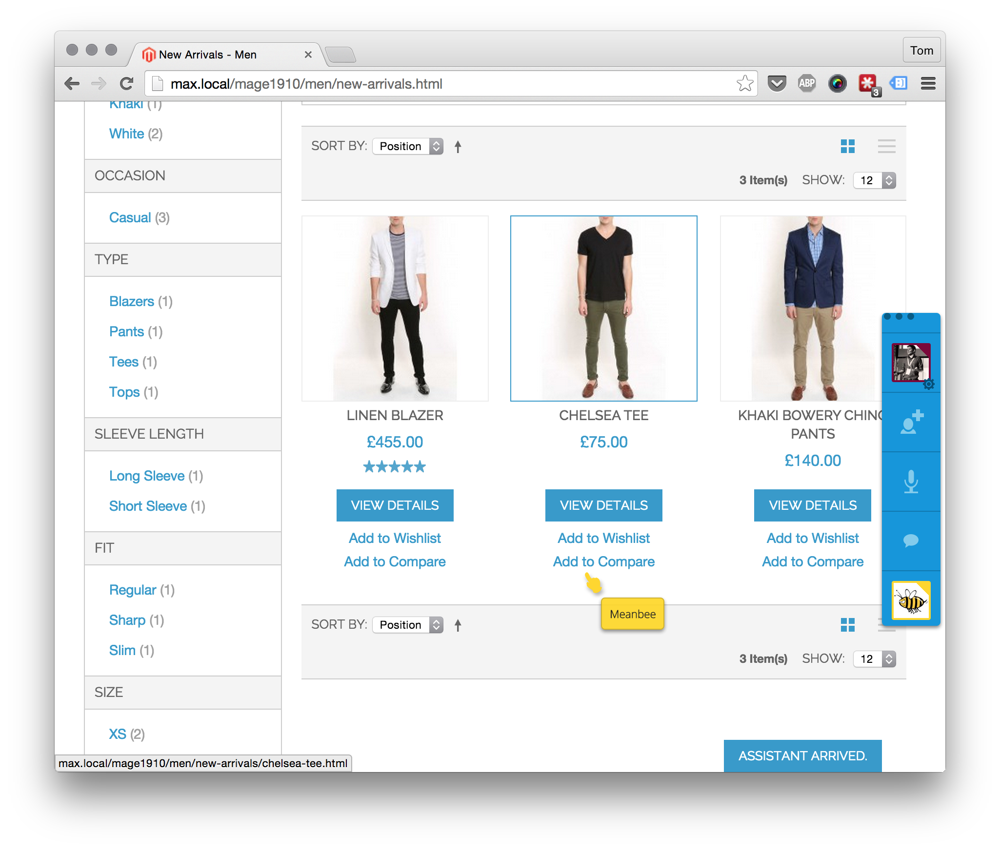
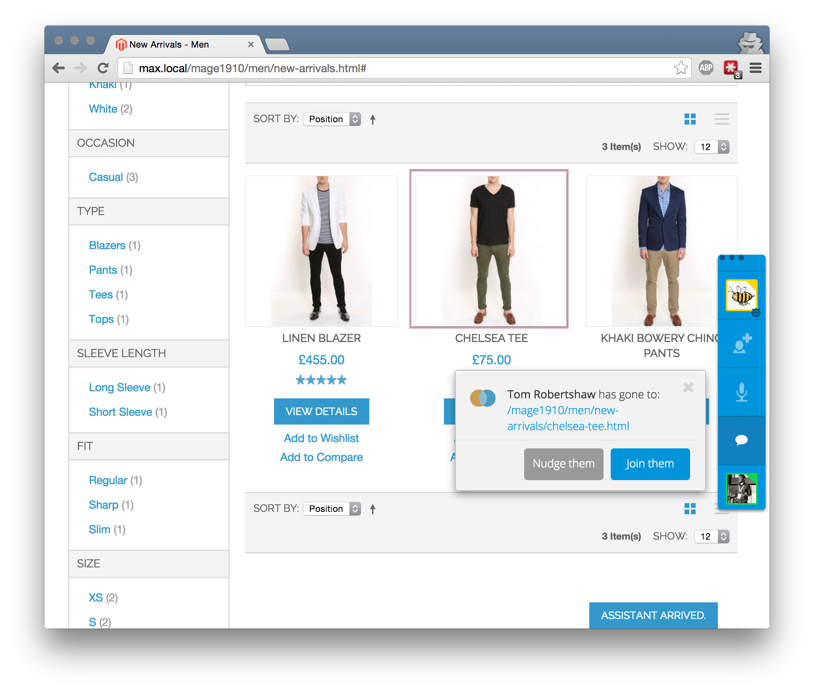
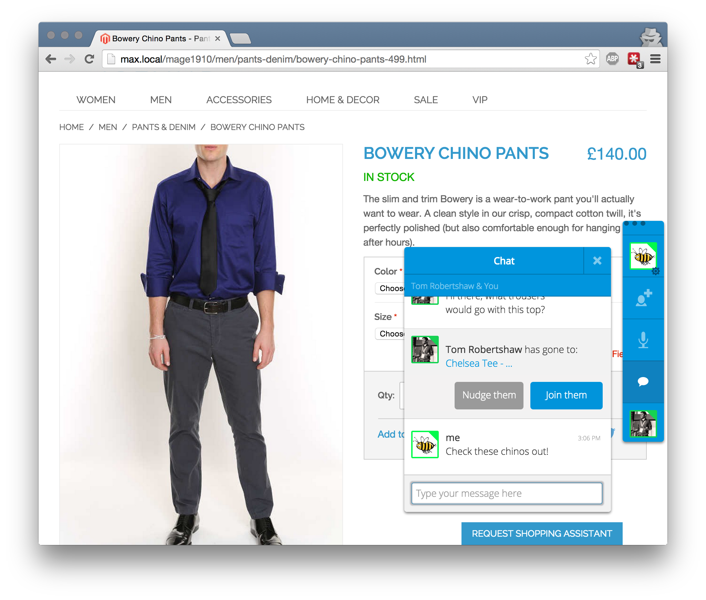
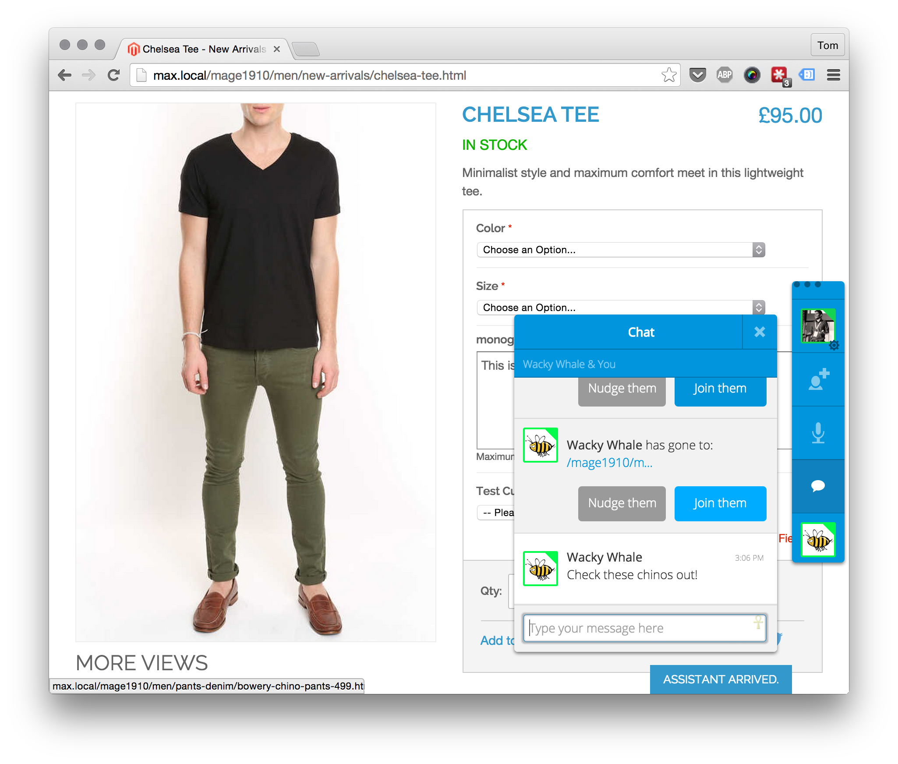

# Magento Shopping Assistant 

This magento extensions uses TogetherJS to create a virtual shopping assistant.  Provide customers with the ability to call over a virtual shopping asssistant. 

The store owner can then join the customer, follow them as they browse around the site, chat with text or voice (using WebRTC) and make suggestions.  

This is much more than a live chat client, it actually helps customers and sales advisors browse the site together and consider products.  A much closer representation to the physical store experience. 

## Demo

A customer browsing a category page can click the "Request shopping assistant" button at the bottom of the page.

Once clicked, the button updates to indicate that they are awaiting an assistant

As the customer is logged in, we have been able to set up the session with a gravatar from their email address and their name from their Magento account.

The store owner views the shopping assistant requets in admin.



Once an admin clicks the link to attend a customer they are directed to the frontend to the same page as the customer.  They should confirm to join the Shopping Assistant session. 



First time the service is used the store owner should set their avatar and name.  It's saved for later use in further sessions.


The customer gets notified when the shopping assistant has arrived. 



Now that the shopping assistant is here, they can send a message to the customer to welcome them!

If the customer moves, the assistant can then follow



The customer would like a product suggestion for an item that goes well with this t-shirt.  The store owner can browse to another page on the site within the chinos category and tell them these would look great!



The customer can see the message, they also see what page the shopping assistant is now viewing and can choose to follow them. 

## Assumptions

- Shopping Assistants cannot make modifications to the customer's basket as sessions are unique to the browser

## To Do

- Works best for logged in customers at the moment. Guests don't get a chance to choose their name and avatar before we've already sent the notification to admin.  Would be nice to put this in the admin grid once we have it. 
- The customer could see the catalog in a different state than the admin, e.g. different prices due to price rules being applied
- TURN server not provided by Mozilla so voice does not work out of the box.
- Assign request to a admin user.
- Use name and avatar of the assigned admin user when they join customer so that the setup process doesn't have to happen
